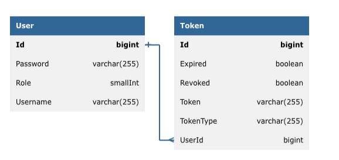

# T1 Homework4 by Иванов Никита Денисович

Это домашняя работа №4 в [рамках открытых школ T1](https://t1.ru/internship/item/otkrytye-shkoly-ot-holdinga-t1/)

Тз к работе вы можете посмотреть по [ссылке](links/Task.md)

## Как начать


### 1. Настройка базы данных
Вам необходимо проставить значение переменных окружения DATABASE_URL, DATABASE_USERNAME DATABASE_PASSWORD это можно сделать командой:
```bash
export DATABASE_URL=<your database url>
export DATABASE_USERNAME=<your database username>
export DATABASE_PASSWORD=<your database password>
```

### 2. Сборка и запуск приложения

Перед запуском приложения необходимо указать `app.jwtSecret`, `app.refresh.jwtExpirationMs` и `app.jwtExpirationMs`. Это можно сделать в файле [application.properties](src/main/resources/application.properties)
Инструкция по сборке и запуску приложения (выполнять из корня проекта):
```bash
mvn clean install
java -jar target/T1-w4-1.0-SNAPSHOT.jar   
```

### 3. Роли

Для данного приложения были разработаны следующие роли: [`ROLE_ADMIN`, `ROLE_POSTS_VIEWERS`, `ROLE_POSTS_EDITORS`, `ROLE_ALBUMS_VIEWERS`, `ROLE_ALBUMS_EDITORS`]
Соответственно `ROLE_POSTS_VIEWERS`, `ROLE_POSTS_EDITORS` могут ходить на следующую ручку `/api/posts/**`,
а роли `ROLE_ALBUMS_VIEWERS`, `ROLE_ALBUMS_EDITORS` могут ходить на `/api/albums/**`.

### 4. Даталогическая модель базы данных



### 5. Тестирование

В качестве доказательства работоспособности приложения были написаны unit-test-ы. Ознакомиться с ними вы можете перейдя по [ссылке](src/test/java/com/example/SecurityTest.java)

## 6. Документация

С документацией openAPI разработанного приложения вы можете ознакомиться перейдя по [ссылке](http://localhost:8082/swagger-ui/index.html#/album-controller/getAllAlbums)

---
**Примечание:** Этот проект разработан исключительно в учебных и демонстрационных целях.